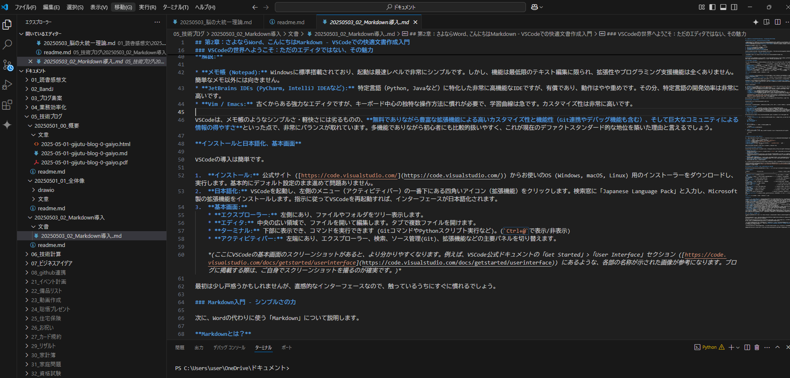
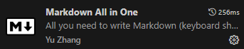
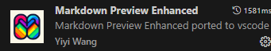
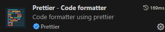

## 第 2 章：さよなら Word、こんにちは Markdown - VSCode での快適文書作成入門

作成日：2025/5/4
作成者：taguchi
修正日：20255/5

### はじめに：なぜ Word を離れ、Markdown と VSCode を選ぶのか？

第 1 章では、私が長年愛用してきた Microsoft Office 製品群、特に Word や Excel と、期待していた Copilot との連携に感じた課題、そしてその解決策として「VSCode を中心とした新しいワークフロー」を目指すことをお話ししました。AI との連携の悪さ、バージョン管理の難しさ、そしてテキストベース作業との親和性の低さ…これらの課題を克服するために、私は Word を手放し、**Markdown**というシンプルな記法と、**Visual Studio Code (VSCode)** という高機能なエディタの組み合わせに可能性を見出したのです。

この章では、その新しいワークフローの第一歩として、

1.  なぜ**VSCode**を選ぶのか？ (他のエディタとの比較)
2.  **Markdown**とは何か？ (基本的な書き方)
3.  VSCode で Markdown を快適に書くための**拡張機能**
4.  **Word と Markdown のメリット・デメリット**を徹底比較

について、詳しく解説していきます。この章を読み終える頃には、あなたもきっと Markdown と VSCode で文書を作成してみたくなるはずです。

### VSCode の世界へようこそ：ただのエディタではない、その魅力

まず、新しいワークフローの中核となる「Visual Studio Code (VSCode)」についてご紹介します。

**VSCode とは？**

VSCode は、Microsoft が開発し、オープンソース（MIT License）で提供している無料のソースコードエディタです。2015 年の登場以来、その軽快さ、拡張性の高さ、そして強力な機能から急速に支持を広げ、現在では多くの開発者にとってデファクトスタンダードとも言える地位を確立しています。

**他の IDE/エディタとの比較**

世の中には多くのテキストエディタや IDE（統合開発環境）が存在します。なぜその中で VSCode が注目されているのでしょうか？ Windows 標準の「メモ帳」や他の代表的なエディタと比較してみましょう。

| 比較項目                    | VSCode             | メモ帳 (Notepad)   | JetBrains IDEs (PyCharm 等) | Vim / Emacs          |
| :-------------------------- | :----------------- | :----------------- | :-------------------------- | :------------------- |
| **起動速度/軽快さ**         | ◯ (比較的軽快)     | ◎ (最速レベル)     | △ (多機能だが重め)          | ◎ (最速レベル)       |
| **拡張性・機能 (Git 含む)** | ◎ (非常に豊富)     | ✕ (ほぼ無し)       | ◎ (言語特化で強力)          | ◎ (カスタマイズ自在) |
| **デバッグ機能**            | ◎ (強力)           | ✕ (無し)           | ◎ (非常に強力)              | △ (設定が必要)       |
| **コミュニティ/情報**       | ◎ (巨大、活発)     | △ (情報は少ない)   | ◯ (活発)                    | ◯ (根強い人気)       |
| **コスト**                  | ◎ (無料)           | ◎ (OS 標準)        | △ (有料、一部無料版有)      | ◎ (無料)             |
| **初心者向け度**            | ◎ (比較的容易)     | ◎ (超シンプル)     | ◯ (高機能だが分かり易い)    | △ (学習曲線が急)     |
| **総合評価**                | ◎ (高機能・拡張性) | △ (最低限のメモ用) | ◯ (特定言語開発)            | △ (熟練者向け)       |

**評価基準:** ◎:非常に良い / ◯:良い / △:良くない / ✕:悪い

**解説:**

- **メモ帳 (Notepad):** Windows に標準搭載されており、起動は最速レベルで非常にシンプルです。しかし、機能は最低限のテキスト編集に限られ、拡張性やプログラミング支援機能は全くありません。簡単なメモ以外には向きません。
- **JetBrains IDEs (PyCharm, IntelliJ IDEA など):** 特定言語（Python, Java など）に特化した非常に高機能な IDE ですが、有償であり、動作はやや重めです。その分、特定言語の開発効率は非常に高いです。
- **Vim / Emacs:** 古くからある強力なエディタですが、キーボード中心の独特な操作方法に慣れが必要で、学習曲線は急です。カスタマイズ性は非常に高いです。

VSCode は、メモ帳のようなシンプルさ・軽快さには劣るものの、**無料でありながら豊富な拡張機能による高いカスタマイズ性と機能性（Git 連携やデバッグ機能も含む）、そして巨大なコミュニティによる情報の得やすさ**といった点で、非常にバランスが取れています。多機能でありながら初心者にも比較的扱いやすく、これが現在のデファクトスタンダード的な地位を築いた理由と言えるでしょう。

**インストールと日本語化、基本画面**

VSCode の導入は簡単です。

1.  **インストール:** 公式サイト ([https://code.visualstudio.com/](https://code.visualstudio.com/)) からお使いの OS (Windows, macOS, Linux) 用のインストーラーをダウンロードし、実行します。基本的にデフォルト設定のまま進めて問題ありません。
2.  **日本語化:** VSCode を起動し、左側のメニュー（アクティビティバー）の一番下にある四角いアイコン（拡張機能）をクリックします。検索窓に「Japanese Language Pack」と入力し、Microsoft 製の拡張機能をインストールします。指示に従って VSCode を再起動すれば、インターフェースが日本語化されます。
3.  **基本画面:**
    _ **エクスプローラー:** 左側にあり、ファイルやフォルダをツリー表示します。
    _ **エディタ:** 中央の広い領域で、ファイルを開いて編集します。タブで複数ファイルを開けます。
    _ **ターミナル:** 下部に表示でき、コマンドを実行できます (Git コマンドや Python スクリプト実行など)。(`Ctrl+@`で表示/非表示)
    _ **アクティビティバー:** 左端にあり、エクスプローラー、検索、ソース管理(Git)、拡張機能などの主要パネルを切り替えます。
    

最初は少し戸惑うかもしれませんが、直感的なインターフェースなので、触っているうちにすぐに慣れるでしょう。

### Markdown 入門 - シンプルさの力

次に、Word の代わりに使う「Markdown」について説明します。

**Markdown とは？**

Markdown は、プレーンテキストで書かれた文書を、簡単な記号を使って構造化するための軽量マークアップ言語です。エンジニアのブログ記事やソフトウェアの README ファイルなどで広く使われています。

**なぜ Markdown を使うのか？**

- **シンプルで覚えやすい:** 使う記号の種類が少なく、基本的な記法なら数時間で習得可能です。
- **軽量・高速:** プレーンテキストなのでファイルサイズが小さく、どんなエディタでも軽快に動作します。
- **テキストベース:** 特別なソフトがなくても内容を読め、Git での変更箇所の比較（差分表示）も非常に分かりやすいです。
- **HTML への変換が容易:** Web ページで表示するための HTML に簡単に変換でき、ブログ記事などの作成にも適しています。
- **思考を止めない:** Word のように「この部分のフォントサイズは…」「インデントをどうしよう…」といった書式設定に気を取られることなく、文章の内容そのものに集中できます。

**最低限覚えるべき基本記法**

Markdown には様々な記法がありますが、まずは以下の 3 つを覚えれば、構造的な文書の骨格を作ることができます。

1.  **見出し (`#`)**
    `#` の後に **半角スペース** を入れてから見出しテキストを書きます。`#` の数で見出しのレベルを表現します（通常、`#` 一つが最も大きな見出し）。

    ```markdown
    # 第 1 章 タイトル

    ## 1.1 最初のセクション

    ### 1.1.1 詳細項目
    ```

2.  **太字 (`**`)**
強調したいテキストを `\*\*` （アスタリスク 2 つ）で囲みます。

                                        ```markdown
                                        これは**非常に重要**なポイントです。
                                        ```

3.  **水平線 (`---` または `\***`)\*\*
    3 つ以上のハイフンやアスタリスクだけで行を構成すると、区切り線になります。話の転換点などに便利です。

    ```markdown
    ---
    ---
    ```

---

**今後覚えると便利な記法 (少しだけ紹介)**

これだけでも文書は書けますが、表現力を高めるために、以下のような記法も今後少しずつ覚えていくと良いでしょう。これらについては、後の章で実際に使いながら解説していきます。

- **リスト:** 箇条書き (`*` や `-`) や番号付きリスト (`1.`, `2.`)
- **リンク:** 他の Web ページや文書内の特定箇所へのリンク (`[表示名](URL)`)
- **画像:** 画像ファイルの表示 (``)
- **引用符:** 他の文章を引用する (`> `)
- **コードブロック:** プログラムコードなどを整形して表示 (`` `バッククォート3つ` `` で囲む)
- **テーブル（表）:** (`|` と `-` を使う)

いきなり全てを覚える必要はありません。まずは基本の 3 つから使ってみましょう。

### VSCode を Markdown エディタとして最適化

VSCode は標準でも Markdown を扱えますが、拡張機能を入れることで、さらに快適な執筆環境を構築できます。ここでは、私が必須だと感じている基本的な拡張機能を紹介します。

- **Markdown All in One:**
  
  Markdown を書く上で便利な機能が詰まった定番拡張機能。太字 (`Ctrl+B`) のショートカットキー、リストの自動継続や編集支援、文書内の見出しから目次を自動生成する機能など、これ一つで格段に執筆効率が上がります。

- **Markdown Preview Enhanced:**
  
  VSCode 標準のプレビュー機能よりも高機能なプレビューを提供します。文書を書きながら、リアルタイムで最終的な出力に近いイメージを確認できる「リアルタイムプレビュー」(`Ctrl+K V`で表示) は、Markdown 執筆において非常に重要です。この拡張機能は、数式 (LaTeX)、作図 (Mermaid, PlantUML)、コード実行結果の埋め込みなど、高度な機能もサポートしています（これらも後の章で触れます）。

- **Prettier - Code formatter:**
- 
  Markdown ファイルだけでなく、様々な言語のコードの見た目を自動で整形してくれるツール。インデント、スペース、改行などを統一ルールに従って自動修正してくれるため、手動での整形の手間が省け、誰が書いても読みやすい文書になります。保存時に自動で整形するように設定しておくと非常に便利です。
- **Japanese Language Pack for Visual Studio Code:**
- 
  先ほど紹介した日本語化のための拡張機能です。

これらの拡張機能は、VSCode のアクティビティバーの拡張機能アイコン（四角いブロックのアイコン）から簡単に検索・インストールできます。

### 徹底比較！ Word vs Markdown - あなたの文書作成、どちらが最適？

さて、いよいよ Word と Markdown を直接比較してみましょう。それぞれのメリット・デメリットを理解することで、どちらが自分の用途に適しているか判断しやすくなります。

**比較表**

| 比較項目                  | Microsoft Word                                           | Markdown (+ VSCode & 拡張機能)                                     | コメント                                                             |
| :------------------------ | :------------------------------------------------------- | :----------------------------------------------------------------- | :------------------------------------------------------------------- |
| **文書作成 (基本)**       | ◯ (WYSIWYG, 豊富機能)                                    | ◎ (軽快, シンプル, 集中できる)                                     | Word は見たまま編集、Markdown は記法で構造化。                       |
| **書式設定**              | ◯ (GUI で多彩だが、おせっかい機能で意図しない動作も)     | ◯ (基本はシンプル, CSS 等で拡張可)                                 | Word は自由度高いが崩れやすい。Markdown は意図しない崩れは少ない。   |
| **動作速度・安定性**      | △ (重い, ファイル破損リスク)                             | ◎ (軽量・高速, テキストで安定)                                     | 大量文書や複雑な書式で Word は不安定になることも。                   |
| **バージョン管理**        | △ (SharePoint 連携あるも不十分)                          | ◎ (Git/GitHub と完璧連携)                                          | テキストベースの Markdown は差分管理が非常に容易。                   |
| **画像の扱い**            | △ (操作性クセ強い △, ズレ・歪み発生 △)                   | ◯ (コピペ挿入容易(拡張), パス管理)                                 | Word の画像配置は直感的だが挙動が複雑。Markdown はパス管理が必要。   |
| **相互参照 (図表番号等)** | ◎ (得意, 自動更新)                                       | △ (標準機能なし, ツール/拡張で代替可)                              | 長文の正式文書では Word が有利。Markdown は代替策が必要。            |
| **ヘッダー/フッター**     | ◎ (得意)                                                 | △ (標準機能なし, PDF 変換ツール等で代替可)                         | 定型的なヘッダー/フッターは Word が圧倒的に楽。                      |
| **PDF 出力 (目次)**       | ◎ (簡単, クリック可能目次)                               | ◯ (拡張/ツールで可能, 品質はツール依存)                            | Markdown も目次付き PDF は作れるが、Word ほど手軽ではない。          |
| **機密性/暗号化**         | ◯ (パスワード保護機能あり)                               | △ (ファイル自体に機能なし, OS/Git 等で対策)                        | Markdown ファイル自体の保護機能はないため、運用でのカバーが必要。    |
| **学習コスト**            | ◯ (多くの人が利用経験あり)                               | △ (記法は容易だが概念に慣れが必要)                                 | Markdown 記法は簡単だが、Word の操作感からの移行には少し慣れが必要。 |
| **AI 連携**               | △ (Copilot, 連携に課題あり)                              | ◎ (Gemini 等, VSCode 連携 ◎, テキスト相性 ◎)                       | テキストベースである Markdown は AI との親和性が高い。               |
| **総合評価/適する用途**   | ◯ (ビジネス定型文書, 共同編集(SharePoint), WYSIWYG 重視) | ◎ (個人メモ, ブログ記事, 技術文書, コード連携, バージョン管理重視) | 用途に応じて使い分けるのが賢明。                                     |

**評価基準:** ◎:非常に良い / ◯:良い / △:良くない / ✕:悪い

**詳細解説:**

- **相互参照 (リレーションシップ):** 長文の報告書や論文で必須となる図表番号や章番号の相互参照と自動更新は、Word の得意技です。Markdown 単体ではこの機能はありません。代替策として、VSCode の拡張機能、Pandoc（文書変換ツール）、静的サイトジェネレーターなどがありますが、設定や使いこなしに一手間必要です。ただし、日常的な文書では不要なケースも多いでしょう。
- **書式設定とおせっかい機能:** Word のリッチな書式設定は魅力ですが、意図しないところでスタイルが変わったり、レイアウトが崩れたりすることがあります。また、オートコレクトやオートフォーマットといった「おせっかい機能」が、入力中に勝手に文字を変換したり、箇条書きの形式を変えたりして、イライラさせられることも。これらは設定でオフにできますが、初期設定では有効になっていることが多いです。Markdown は基本的にプレーンテキストなので、「勝手に書式が変わる」ストレスとは無縁です。
- **ヘッダー/フッター:** ページ番号や文書タイトルなどを全ページ共通で表示したい場合、Word のヘッダー/フッター機能は非常に簡単で便利です。Markdown にはこの概念がないため、PDF 化する際のツール（Pandoc+LaTeX テンプレート等）や HTML 経由の CSS で設定する必要があります。
- **機密性/暗号化:** Word にはパスワード保護機能があります。Markdown ファイル自体はただのテキストなので、保護機能はありません。機密情報を扱う場合は、OS レベルの暗号化（BitLocker 等）や Git リポジトリのアクセス制御など、ファイルやフォルダ自体を保護する運用が必要です。
- **PDF 出力と目次:** Word は簡単に目次を作成でき、クリック可能なリンク付き PDF として出力できます。Markdown からも VSCode 拡張機能（例: `Markdown PDF`）で目次付き PDF は作成可能ですが、Word ほど手軽ではありません。Pandoc+LaTeX を使えば書籍レベルの高品質な PDF も可能ですが、学習が必要です。
- **見たまま印刷 (WYSIWYG):** Word は画面表示と印刷結果がほぼ一致する安心感があります。Markdown はプレビューで確認しますが、最終出力は変換ツールや設定次第です。慣れが必要ですが、テンプレートを切り替えることで多様な出力に対応できる柔軟性があります。
- **画像の扱い:** Word での画像挿入は直感的ですが、「文字列の折り返し」や「アンカー（固定位置）」の設定が非常に複雑で、「クセが強い」と感じる人も多いでしょう。意図通りに配置できず、行の挿入などで簡単にレイアウトが崩れることもあります。ファイルサイズも増大します。Markdown では画像は別ファイルとしてパスで管理します。VSCode 拡張機能を使えばクリップボードからのペーストでファイル保存と記述挿入を自動化でき、非常にスムーズです。HTML タグでサイズ調整も可能です。ファイルの管理方法は異なりますが、慣れればシンプルです。

### まとめ：最初の一歩を踏み出そう

この章では、新しい文書作成ワークフローの中核となる VSCode の導入と、Word に代わるシンプルな文書記述法である Markdown の基本、そして両者を比較した場合のメリット・デメリットについて解説しました。

VSCode の軽快さ、拡張性、安定性。Markdown のシンプルさ、テキストベースであることの利点（バージョン管理、検索性、AI 連携）。これらは、日々の文書作成における多くのストレスを軽減し、より本質的な内容に集中するための強力な武器となるはずです。

学習コストについて、Markdown の記法自体は非常に簡単ですが、Word の操作感に慣れていると、最初はプレーンテキストで構造を記述するという考え方に少し戸惑うかもしれません。そのため評価を「△」としましたが、これは「難しい」という意味ではなく「慣れが必要」というニュアンスです。

もちろん、Word にしかない利点もあります（高度な相互参照、手軽なヘッダー/フッター、ビジネス文書でのフォーマットの共通認識など）。すべての文書を Markdown に置き換える必要はありません。ブログ記事、技術メモ、個人の議事録、コードを含む文書など、**テキストベースで管理したい、バージョン管理したい、軽快に書きたい、AI と連携させたい** といった用途には、Markdown + VSCode の組み合わせが非常に強力な選択肢となります。

まずは VSCode をインストールし、この章で紹介した基本記法（見出し、太字、水平線）を使って、簡単なメモや下書きから始めてみてはいかがでしょうか？

次章では、Markdown の表現力をさらに高める「数式」と「図」の扱い方について解説していきます。技術文書やレポート作成にも役立つ内容ですので、ぜひご期待ください。
