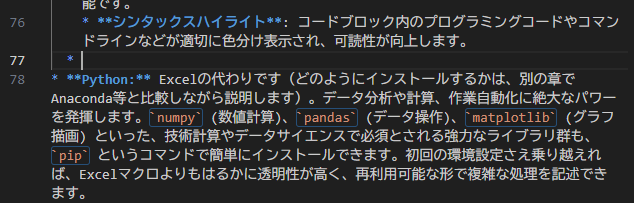

## 第1章：【導入】なぜ私はOfficeを捨てようと思ったのか？ - 新しいワークフローへの挑戦

作成日: 2025/5/1
作成者：taguchi

---

## 概要
* **現状の課題:** Microsoft Office製品と生成AI (Copilot) の連携における不満。テキストベース作業との相性。
* **目指す未来:** VSCodeをハブとし、Markdown、Python (手動インストール)、Git、Gemini連携の新ワークフロー。効率化・自動化を目指す。
* **このブログでやること:** 移行プロセス、ツール活用法、メリット・デメリット、実践例の共有。
* **具体的な用途例:** 読書感想文、技術検討書作成 (Pythonスクリプト + Markdownドキュメント)、社内メッセージ作成、アプリプロトタイプ作成、既存フロー図のデジタル化など。
---

### 青写真

---
### 本論　詳細
---

### 「便利になるはずが…」 CopilotとOffice製品に感じた期待と現実のギャップ

皆さんは、日々の業務でMicrosoft Office製品群（Word, Excel, PowerPointなど）をどのくらい使っていますか？ おそらく、私と同じように「仕事に不可欠なソフト」として長年頼りにしてきた方が多いのではないでしょうか。報告書の作成、（実験）データ集計・分析、顧客への提案資料作りまで、私たちの仕事は常にOfficeと共にありました。
私自身、過去にはMOS Excel上級を取得したり、修士論文では200を超える数式の番号管理をフィールドコードで自動化したりと、それなりにOfficeを使いこなしてきたという自負があります。

そこに現れたのが、生成AI「Copilot」です。「Office作業がAIで劇的に効率化される！」——そのニュースに、私は大きな期待を寄せました。面倒な定型作業から解放され、より創造的な仕事に集中できる未来を夢見たのです。その期待は大きく、Copilotを使うためだけに、当時エンタープライズ版の契約が必要と聞き、個人で企業登録を行い、サーバー環境まで用意したほどでした。

しかし、鳴り物入りで登場したCopilotを実際に使ってみると、「あれ？ 思っていたのと違う…」と感じる場面が少なくありませんでした。指示通りに動いてくれない、生成結果の精度が低い、意図しない変更が加えられて修正に時間がかかる、そして何より動作が重く、思考が度々中断される…。

もちろん、AI技術は発展途上です。しかし、CopilotがOfficeに搭載されてから1年以上（2025年5月現在）経っても、この「もどかしさ」がなかなか解消されない状況に、正直、かなり嫌気が差してきました。同じGPT-4（あるいはその後継モデル）をベースにしているはずなのに、OpenAIがWebで提供しているChatGPTと比較して、Office内のCopilotの応答精度や速度が明らかに劣ると感じる場面が多々あったのです。

これは単にCopilotの性能だけの問題なのでしょうか？ むしろ、**Officeという長年使われてきたソフトウェアの土台と、生成AIという新しい技術、そして私が求めるテキストベースでの柔軟な作業スタイルとの間に、根本的な「相性の悪さ」があるのではないか**、と考えるようになりました。

Microsoftのような巨大企業は、安定性を重視するあまり、変化の激しい生成AIの進化スピードに追随できていないのかもしれません（いわゆる大企業病でしょうか…）。先のロードマップが計画されていることは安定性の証左かもしれませんが、裏を返せば、小回りの利く対応が難しいということかもしれません。LLM（大規模言語モデル）が「言語」を扱うことに特化しているのに対し、Office製品は「GUI（グラフィカル・ユーザー・インターフェース）」での操作を前提に作られており、この根本的な設計思想の違いが、連携のボトルネックになっているのではないでしょうか。

### 比較：現状のOffice環境 vs 目指すVSCode中心ワークフロー

まずは、私が感じている課題と、これから目指す新しいワークフローで期待される改善点を、主要な作業項目ごとに比較してみましょう。（詳細は後述します）

| 比較項目                 | Microsoft Office (Word/Excel) + Copilot                     | VSCode + Markdown + Python + Gemini(API) + Git                     |
| :----------------------- | :------------------------------------------------------------ | :-------------------------------------------------------------- |
| **文書作成** | ◯ (豊富な機能、テンプレート)                                    | ◎ (軽快、シンプル、書式崩れ少、AI連携◎)                          |
| **表計算・データ分析** | ◯ (多機能、グラフ、アドイン)                                  | ◎ (強力なライブラリ、自動化、再現性◎、AI連携◎)                  |
| **数式作成** | △ (GUI操作が煩雑、LaTeX非対応、AI連携✕)                          | ◎ (LaTeXで美麗かつ効率的、AI連携◎)                             |
| **バージョン管理** | △ (SharePoint連携あるもファイル破損リスク、Git非対応)             | ◎ (Git/GitHub連携◎、差分管理明確)                                |
| **AI連携 (文書)** | △ (Copilot精度・速度・柔軟性に課題、部分適用難)                | ◎ (Geminiインライン編集◎、柔軟な指示、API連携◎)              |
| **AI連携 (コード/計算)** | △ (Copilotでは限定的、VBA生成も修正コピペ…)                     | ◎ (コード生成・リファクタリング◎、計算ロジック相談◎)               |
| **画像の扱い** | △ (Wordキャプション操作性△、Excel行挿入でズレ△)             | ◯ (Markdownコピペ挿入容易、サイズ調整可)                          |
| **印刷** | △ (Excel：見たまま印刷されず切れること多々)                       | ◯ (Markdown：プレビュー経由で調整可能、PDF化容易)               |
| **動作速度・安定性** | △ (重い、ファイル破損リスク△)                                  | ◎ (軽量・高速、テキストベースで安定◎)                            |
| **コスト (AI含む)** | △ (Officeライセンス + Copilot [約¥4500/月])                     | ◯ (ツール類無料、AI API費用は別途考慮要)                       |
| **拡張性・カスタマイズ** | △ (マクロ、アドイン限定的)                                    | ◎ (豊富な拡張機能で自由に環境構築◎)                            |
| **再現性・属人性排除** | △ (Excel計算過程不透明、書式属人性△)                          | ◎ (コードで手順明確、Markdownで書式統一容易◎)                     |
| **総合評価** | △ (多機能だが重くAI連携に課題、コスト高)                      | ◎ (軽快・高拡張性、AI連携◎、再現性◎、低コスト)                 |

**評価基準:** ◎:非常に良い(AI活用も効果大) / ◯:良い(AI連携は限定的だが機能十分・操作性良) / △:良くない(AI不可・操作性悪・課題あり) / ✕:悪い(機能無・不向き)

---

### Officeの"常識"に潜む課題 - なぜ乗り換えを決意したか

上記の比較表で示したように、長年使ってきたOffice製品にも、効率化を阻む課題が潜んでいると感じています。

* **Excelは万能か？**：確かにExcelは素晴らしいツールです。表計算だけでなく、グラフ作成、簡単なデータベース、報告書フォーマット、さらには統計解析やFFT（高速フーリエ変換）といった専門的なデータ分析（アドイン利用）までこなします。マス目を正方形にして図面の代わりに使うような裏技的な活用法も存在します。しかし、その多機能性ゆえに、複雑な計算ロジックはブラックボックス化しがちです。「この数字、どうやって計算したんだっけ？」と後で追うのが困難になることも。計算の順番や前提条件もファイルを見ただけでは分かりにくいことが多いのです。
* **数式作成の手間**: WordやExcelにも数式エディタはありますが、複雑な数式や多数の数式を扱う場合、GUIでの操作は非常に煩雑で時間がかかります。LaTeXのようなテキストベースの記述に慣れていると、その非効率さが際立ちます。
* **印刷の難しさ**: 特にExcelでは、画面で見えている通りに印刷されず、意図しないところで改ページされたり、表が途中で切れたりすることが頻繁に起こります。印刷プレビューで何度も調整が必要になることも少なくありません。
* **バージョン管理とファイル破損の悪夢**：SharePointを使えば、ファイルの同時編集や変更履歴の確認はある程度可能になりました。しかし、「ファイルが破損して開けなくなった」という致命的な問題は、依然として根本的に解決されていません。これは個人作業でも共同作業でも起こりうる問題で、このファイル破損によって丸一日分の作業が無駄になった、という経験を持つ人は少なくないはずです。これはOfficeファイル形式（バイナリ形式）に根差した問題と言えるかもしれません。
* **リッチテキストの功罪**：Wordなどで文字のスタイルや色、太字などを自由に設定できるのは表現力を高めます。テンプレート機能も便利です。しかし、行の追加や削除を繰り返すうちに書式が崩れたり、テンプレートの意図しない部分が変更されたりすることも。また、「リッチ」であるがゆえに、使う人によって見た目のばらつきが出やすく、統一感を保つのが難しいという側面もあります。
* **自動化の限界と不透明さ**：定型作業を自動化するマクロ（VBA）は、生成AIによって作成のハードルが下がったという声もあります。しかし、結局のところ、生成されたコードが何をやっているのか理解できなければ、ブラックボックスであることに変わりはありません。デバッグや修正も容易ではありません。
* **AI連携の壁 (特にExcel)**：Copilotを使っても、Excelファイル全体の関係性を理解した上で複雑な処理（例：複数のシートを横断した分析や加工）を指示するのは非常に苦手な印象です。部分的なデータ抽出や簡単なグラフ作成はできても、「よしなにやってくれる」レベルには程遠いと感じます。
* **画像の扱いにくさ**：Excelで表に行を挿入したら、貼り付けていた画像の位置がズレたり、縦横比が変わって歪んだりしてイライラしたことはありませんか？ Wordでも、図に説明文（キャプション）を入れる機能はありますが、操作性が良いとは言えず、レイアウト調整に苦労することがあります。

これらの課題は、一つ一つは小さなことかもしれません。しかし、日々の業務の中で積み重なると、無視できないストレスや非効率につながっていきます。

### 目指すは「VSCode中心」の軽快・柔軟・安定なワークフロー

そこで私は、これらの課題を解決するために、Officeへの依存から脱却し、「VSCode」を中心とした、テキストベースの新しいワークフローへ移行することを決意しました。

VSCodeは、単なる高機能なテキストエディタにとどまりません。

* **軽快さと安定性:** Office製品と比較して、起動も動作も非常に軽快です。そして何より、扱っているのが基本的にプレーンなテキストデータなので、私の少ない経験上ですが、Officeファイルのように原因不明の破損に見舞われることは、これまでありませんでした。これは大きな安心感につながります。 VSCode本体は無料で利用できます。
* **統合開発環境としての力:** 豊富な拡張機能を組み合わせることで、文書作成、コーディング、データ分析、バージョン管理、AI連携といった様々な作業を、VSCodeという一つの環境内で完結させることができます。これは、複数のソフトを行き来する手間を省き、集中力を維持する上で非常に重要です。プログラマーだけでなく、多様な職種の方が「自分だけの最強の作業環境」を構築できる可能性を秘めています。多くの便利な拡張機能も、今回検討しているもの（例えば、Markdown支援、Python支援、Git連携など）はMITライセンスなどの無償で商用利用可能なライセンスで提供されています（ただし、GeminiのようなLLMサービス連携は、API利用料などが別途かかる場合があります）。

このVSCodeをハブ（中心）として、以下のツールを有機的に連携させていきます。

* **Markdown:** Wordの代わりです。シンプルで覚えることが少なく、軽快に文書を作成できます。Gitでのバージョン管理も容易で、Webとの親和性も高いです。
    * **Mermaid記法**: テキストで**フローチャートやシーケンス図など**を簡単に記述し、プレビューで視覚的に確認できます。
    * **LaTeX記法**: 複雑な**数式もテキストベースで美しく、効率的に記述**できます。AIに下書きを依頼することも容易です。
    * **画像の扱い**: 拡張機能を使えば、クリップボードから画像を直接ペーストでき、ファイルへの自動保存やMarkdown記法の挿入、さらには簡単なサイズ調整まで可能です。
    * **シンタックスハイライト**: コードブロック内のプログラミングコードやコマンドラインなどが適切に色分け表示され、可読性が向上します。
  * 例えば下記のようなイメージです
  * 
* **Python:** Excelの代わりです（どのようにインストールするかは、別の章でAnaconda等と比較しながら説明します）。データ分析や計算、作業自動化に絶大なパワーを発揮します。`numpy` (数値計算)、`pandas` (データ操作)、`matplotlib` (グラフ描画) といった、技術計算やデータサイエンスで必須とされる強力なライブラリ群も、`pip` というコマンドで簡単にインストールできます。初回の環境設定さえ乗り越えれば、Excelマクロよりもはるかに透明性が高く、再利用可能な形で複雑な処理を記述できます。
* **Git / GitHub:** ファイルの変更履歴を正確に記録・管理するためのツールです。特にプログラムコードやMarkdown文書のようなテキストファイルとは相性抜群です。アプリケーション開発などエンジニアリングの世界では必須とも言えますが、個人や小規模チームの文書管理においては、「必須ではないが、あると非常に便利で安心」という位置づけでしょうか。今回は、個人作業では積極的にGitHubを活用していきます。
* **Gemini (Google AI) / その他LLM API:** Copilotの代わりとなるAIアシスタントです。VSCode内で直接連携（主にAPI経由）でき、特にテキストやコードを選択して部分的に修正・改善を指示できる「インライン編集」機能が強力です。APIを利用することで、最新のモデル性能を活用しやすく、様々なタスクに応用できます。 料金は利用量に応じますが、使い方を工夫すればコストを抑えることも可能です。企業によっては、セキュリティが確保されたAzure OpenAI Serviceなどを利用してChatGPTを活用するケースも増えています。これらのLLM APIをVSCodeから利用することで、コーディング支援、文章作成支援、アイデア出しなどをシームレスに行えます。

この新しいワークフローによって、**「コピペ地獄からの解放」「ミスの削減」「作業の自動化・効率化」「変更履歴の明確化による安心感」「思考を止めない軽快な動作」**といった、より快適で生産的な働き方が実現できると期待しています。

### このブログで共有したいこと

この一連のブログでは、私がOffice中心の環境から、VSCodeを中心とした新しいワークフローへ移行していく過程を、試行錯誤も含めて正直に記録・共有していきます。

具体的には、

* 各ツールのインストールや基本的な使い方
* ツール同士を連携させる具体的な方法
* 実践的な活用例（技術検討書作成、レポート作成、フロー図作成など）
* 移行中にぶつかった壁や、それをどう乗り越えたか

といった内容を、ステップバイステップで解説していく予定です。Officeに慣れ親しんだ方にとっては、最初は少し学習コストがかかるかもしれません。しかし、このブログが、同じような課題を感じている方、より良い働き方・学び方を模索している方にとって、実践的なヒントや次の一歩を踏み出す勇気を提供できれば、これ以上の喜びはありません。

### あなたの「仕事」や「学び」も、もっと効率化できるかも？

このブログで紹介するワークフローは、決して特定分野の専門家だけのものではありません。

* **レポートやブログ記事作成**が、もっとスムーズになるかもしれません。
* **データ集計や分析作業**が、もっと速く、正確になるかもしれません。
* **定型的な資料作成**から解放され、もっと創造的なことに時間を使えるようになるかもしれません。
* **手書きのメモや古い図面**を、効率的にデジタル化し、活用できるようになるかもしれません。

もし、あなたが日々の業務や学習の中で、「もっと効率的にできないかな？」「この作業、自動化できないかな？」と感じているなら、このブログで紹介する方法が、何かを変えるきっかけになるかもしれません。

さあ、一緒にOffice依存から一歩踏み出し、VSCodeとAIを活用した新しいワークフローを探求してみませんか？ 次章からは、具体的なツールの導入と使い方について解説していきます。どうぞお楽しみに！